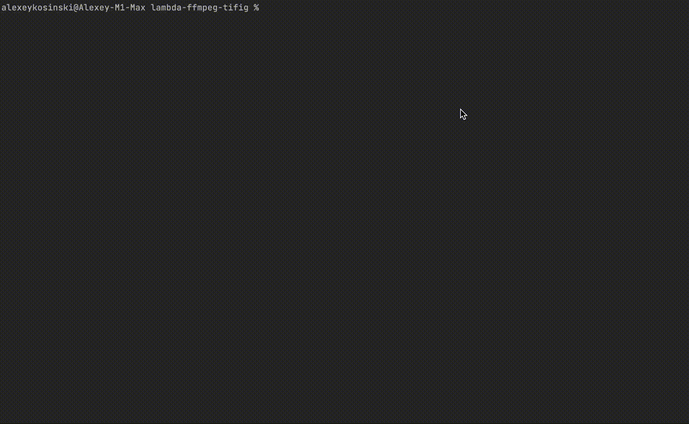

# Article

Detailed article here https://habr.com/ru/post/648519

# Create thumbs with Serverless + Lambda + ffmpeg

# With ffmpeg you can create thumb:



# Let's setup it in cloud
(install Serverless Framework, before setup)
```
sls deploy
```
# After install you will see:


# Test results:


